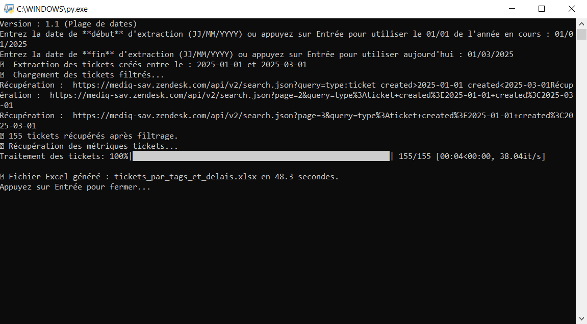

# Extraction des KPI Zendesk

Ce script Python extrait des indicateurs clés à partir de tickets Zendesk.

## Sommaire
- [Fonctionnalités](#fonctionnalités)
- [Installation](#installation)
- [Configuration](#configuration)
- [Usage](#usage)
- [Avertissement](#avertissement)
- [Exemple d’exécution](#exemple-dexécution)

## Fonctionnalités

- Comptabilise uniquement les tickets des types : `task`, `question`, `incident`
- ⚠️ Les tickets `Problem` sont transférés dans `incident` (vous pouvez supprimer ce paramètre si c'est gênant pour vous)
- Calcule les délais de première réponse et de résolution
- Analyse la satisfaction client, au mois aussi
- Exporte les résultats dans un fichier Excel sous forme de plusieurs onglets

## Installation

Installez les dépendances :  
Ouvrez l’invite de commandes (CMD) et tapez :

```bash
pip install requests openpyxl tqdm
```

Si vous n'avez pas Python installé, vous pouvez le télécharger ici :  
👉 [https://www.python.org/downloads/](https://www.python.org/downloads/)

## Configuration

Si tu souhaites adapter ce script à ton propre environnement Zendesk, il te suffit de créer ou modifier le fichier `config.json` selon l’exemple ci-dessous :

```json
{
  "SUBDOMAIN": "TonDomaine",
  "EMAIL": "Ton_Nom@courriel.com",
  "API_TOKEN": "La clé d’API (token) que tu auras générée dans les paramètres de Zendesk"
}
```

➡️ **Important :**  
Le fichier `config.json` doit impérativement être placé dans le même répertoire que le script `zendesk_extract_KPI`.

## Usage

Lancez le script avec :

```bash
python zendesk_extract_KPI.py
```

Suivez ensuite les instructions pour choisir la plage de dates.

---

## Avertissement

⚠️ Ne partagez jamais vos clés API publiquement !

## Exemple d’exécution

Voici une capture d'écran du script lors de l'extraction :



---

<sub>
**Tags** : zendesk kpi kpis kpi's KPIs analytics ticket extraction python excel reporting Yann DONNE
</sub>


